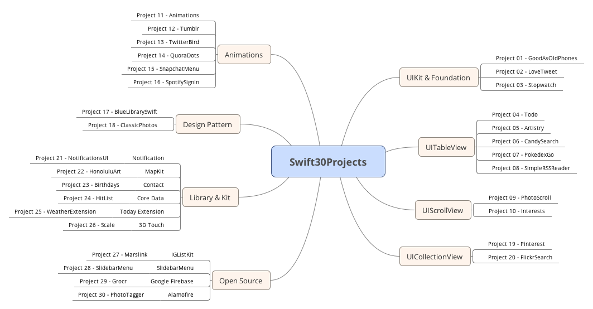

## Swift 30 Projects

## Contents
This repo focus on usage of:

* Simple UIKit components
* UIScrollView, UITableView, UICollectionView
* CAAnimations and UIView Animations
* Local Notification in iOS 10
* MapKit and Contact Frameworks
* Core Data, Today Extension and 3D touch
* Popular Open Source Frameworks
* Design Patterns

## By developers and for developers

I am an iOS developer and currently learning Swift.

This project is inspired by [Soapyigu](https://twitter.com/guyindaozhang)'s [30DaysSwift](https://github.com/soapyigu/Swift30Projects).

